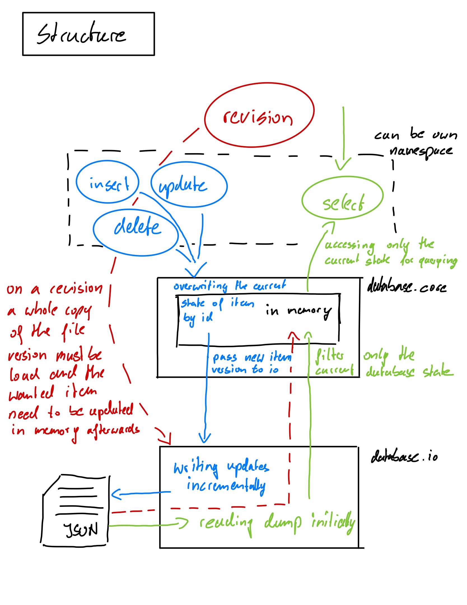

# birdsdb

`birdsdb` is a database written in Clojure, which allows you to store and query objects. Instead of maintaining a single mutuable instance of the provided data, changes get stored as additional records seperated by timestamps so that every state of an object is reproducable and redoable.

While information gets stored persistently in the file system, a running instance of `birdsdb` is working with a selected copy of the database state in memory to improve performance.

Besides that `birdsdb` is build to be scalable. Multiple instances of a database can be run simultaneously on the same data basis while all of those instances keep their state in sync.

`birdsdb` can be accessed by a TCP connection, prompted directly in console, can be integrated in your own Clojure project, or at a later stage also be accessed by several clients.

A complete list of the features can is listed below.

## Installation

For now, `birdsdb` is in a early development stage, so you can only clone and integrate it in your project. While the project is making more progress, this section gets updated.

## Features 

`birdsdb` is a simple database with the following features:
- **storing objects:** The database can store and maintain any kind of hashmap in clojure, but the goal is to either use edn or json as an input and output format through the interface and clients later on.
- **revisions & immutable data:** The database do not mutate any kind of stored object. This has clear advantages: Every change of a data object will result in a additional copy of it in stored in the database. Therefore any change of a data object can be revisioned at any state which once was maintained in the database. Also this technique allows to have a simpler approach of persistent data handling at the file level and allows the given approach of multiple instances (scale) with synced data foundations.
- **in-memory:** While the *single source of truth* of the stored information in the database consists of the maintained files in the file system, `birdsdb` handles queries during runtime with an additional in-memory part. This part is synced with the changes, both from data mutation in the own instance and the detected mutations of other instances when running in synced mode. Therefore querying not depends on the access rate of the file system, but is fastly delivered through holding also a copy of needed in formation in memory. Nevertheless it still can fallback to the stored information in the files at any time, due this part should only boost performance.
- **several connection methods:** Once an instance of the database is running, it can easily accessed over TCP. Also different client libraries are planned. It also can be accessed by starting it in a prompted mode.
- **syncing & scalability:** `birdsdb` works as a standalone database, started as a process and accessed over tcp or the given prompt (for now). Nevertheless also multiple instances of `birdsdb` relying on the same data foundation is possible. Therefore those instances can be run in *synced mode* in which each database instance watches for changes in the filesystem and reacts with adding those to its in-memory database-state copy. Because of the immutable approach of stored objects, falsely repeatedly detected changes of the same data objects, or even older mutations get processed correctly, so that the state of each of the running instances is not in danger at any time.
- **self-managed approach:** While during a mutation process of a data object, `birdsdb` directly write those changes to the file system, to prevent inconsistencies in the data foundation, those single mutations encapsulated in a single file will slow down the startup time of a database instance over time and also produce slidely more io operations as needed. Therefore the database tries to manage it self at several parts of the application. One of those self-managed processes is to summarize the changes written as single encapsulated mutations. By keeping track of the mutations and reacting at a predefined amount of their file representation, the self-managed process summarize those mutation in a file consisting that fixed amount of data objects in a so called *chunk*. As said before chunk enable a more pesistent and less resource consuming inital startup of an database instance as well as in the *sync mode*.

## Usage

... this section will be completed soon ...

## Options

... this section will be completed soon ...

## Examples

... this section will be completed soon ...

## Roadmap

... this section will be completed soon ...

## Bugs

... this section will be completed soon ...

## License

Copyright © 2020 Moritz Kanzler

This program and the accompanying materials are made available under the
terms of the Eclipse Public License 2.0 which is available at
http://www.eclipse.org/legal/epl-2.0.

This Source Code may also be made available under the following Secondary
Licenses when the conditions for such availability set forth in the Eclipse
Public License, v. 2.0 are satisfied: GNU General Public License as published by
the Free Software Foundation, either version 2 of the License, or (at your
option) any later version, with the GNU Classpath Exception which is available
at https://www.gnu.org/software/classpath/license.html.
